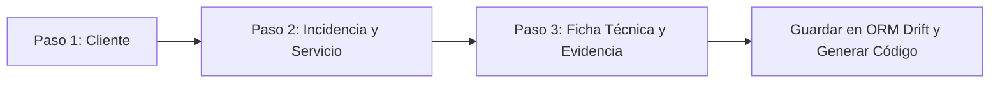

# Especificación de Requerimientos y Arquitectura de Software: Sistema de Gestión de Taller
## Plataforma de Gestión Técnica Multi-Empresa (Marca Blanca) Multiplataforma (Web & Desktop)
**Propósito:** Software genérico personalizable para cualquier empresa, taller o laboratorio de servicio técnico  
**Institución:** Centro de Formación SENA  
**Patrón Arquitectónico:** Clean Architecture (Arquitectura Limpia) + Principios SOLID  
**Motor de Persistencia:** ORM Drift (SQL Type-Safe reactivo para WebAssembly y Desktop Nativo)  
**Framework:** Flutter 3.22+ / Dart 3.4+  

---

## 1. Justificación y Argumentación Técnica ante Evaluadores del SENA

Al defender este proyecto ante el comité evaluador del SENA, el equipo técnico argumentará los siguientes pilares de ingeniería de software:

1. **Adopción de Clean Architecture (Tío Bob / Robert C. Martin):**
   - **Independencia de Frameworks y UI:** La lógica del taller (liquidación de repuestos, cálculo de garantías, flujos de diagnóstico y entrega) reside en la capa de *Dominio*, sin acoplamiento a Flutter ni a widgets.
   - **Regla de Dependencia:** Las dependencias apuntan estrictamente hacia adentro. La capa de presentación y la capa de datos dependen de las interfaces (abstracciones) definidas en el dominio.
   - **Testabilidad y Mantenibilidad:** Facilidad de implementar pruebas unitarias sobre casos de uso sin necesidad de montar la base de datos o la interfaz gráfica.

2. **Persistencia Multiplataforma mediante ORM Drift (Desktop + Web):**
   - **Desktop (Windows / macOS / Linux):** Utiliza SQLite de alto rendimiento mediante enlaces directos a la biblioteca de sistema `sqlite3` vía FFI (Foreign Function Interface), garantizando persistencia local de grado industrial, cero latencia y funcionamiento 100% *offline-first*.
   - **Web (Navegadores modernos):** Utiliza SQLite compilado a **WebAssembly (Wasm)** respaldado por OPFS (Origin Private File System) o IndexedDB a través de `WasmDatabase`. El técnico puede abrir el sistema en Chrome/Edge o ejecutarlo como binario nativo `.exe` en Windows sin cambiar una sola línea de lógica de negocio.
   - **Type-Safety en Tiempo de Compilación:** Evita sentencias SQL en texto plano con riesgo de error tipográfico o inyecciones de datos, generando automáticamente clases de datos inmutables y DAOs reactivos con soporte para Streams.

3. **Herramienta Técnica Especializada para Mesón de Trabajo:**
   - Registro de evidencia visual en tiempo real (fotografías de recepción, placa madre, disipación y terminado).
   - Control de trazabilidad de insumos químicos y físicos aplicados (pasta térmica de alto rendimiento, alcohol isopropílico 99.8%, limpiador dieléctrico).
   - Liquidación financiera transparente de mano de obra y repuestos.
   - Emisión y firmado digital/físico de Actas de Entrega con validez jurídica bajo el Estatuto del Consumidor (Ley 1480 de Colombia).

---

## 2. Estructura del Proyecto en Clean Architecture

```text
tickets-app/
├── lib/
│   ├── core/
│   │   ├── constants/
│   │   │   ├── app_colors.dart
│   │   │   └── taller_constants.dart          # NIT, Razón Social, Slogan, Teléfonos
│   │   ├── database/
│   │   │   ├── app_database.dart              # Instancia principal de Drift con tablas y DAOs
│   │   │   ├── tables.dart                    # Definición formal de las 8 tablas en Drift
│   │   │   └── connection/
│   │   │       ├── connection.dart            # Export condicional multiplataforma
│   │   │       ├── native.dart                # Fábrica de conexión SQLite Desktop (FFI)
│   │   │       └── web.dart                   # Fábrica de conexión SQLite WebAssembly (Wasm)
│   │   ├── errors/
│   │   │   ├── exceptions.dart
│   │   │   └── failures.dart
│   │   ├── theme/
│   │   │   └── app_theme.dart                 # Colores institucionales Santi INC
│   │   └── utils/
│   │       ├── currency_formatter.dart        # Formato de moneda COP ($)
│   │       └── pdf_generator.dart             # Generación oficial de PDF con membrete
│   │
│   ├── features/
│   │   │
│   │   ├── ordenes/
│   │   │   ├── domain/                        # CAPA DE DOMINIO (Pura, cero Flutter)
│   │   │   │   ├── entities/
│   │   │   │   │   ├── cliente_entity.dart
│   │   │   │   │   ├── equipo_entity.dart
│   │   │   │   │   ├── orden_entity.dart
│   │   │   │   │   ├── formato_ot_entity.dart
│   │   │   │   │   ├── bitacora_taller_entity.dart
│   │   │   │   │   ├── repuesto_entity.dart
│   │   │   │   │   ├── acta_entrega_entity.dart
│   │   │   │   │   └── dashboard_metrics_entity.dart
│   │   │   │   ├── repositories/
│   │   │   │   │   └── i_ordenes_repository.dart  # Contrato/Interface abstracta
│   │   │   │   └── usecases/
│   │   │   │       ├── get_dashboard_metrics_usecase.dart
│   │   │   │       ├── get_ordenes_filtradas_usecase.dart
│   │   │   │       ├── create_orden_completa_usecase.dart
│   │   │   │       ├── update_taller_diagnostico_usecase.dart
│   │   │   │       ├── update_bitacora_repuestos_usecase.dart
│   │   │   │       ├── add_foto_evidencia_usecase.dart
│   │   │   │       └── cerrar_orden_acta_usecase.dart
│   │   │   │
│   │   │   ├── data/                          # CAPA DE DATOS
│   │   │   │   ├── datasources/
│   │   │   │   │   ├── ordenes_local_datasource.dart
│   │   │   │   │   └── daos/
│   │   │   │   │       ├── clientes_dao.dart
│   │   │   │   │       ├── equipos_dao.dart
│   │   │   │   │       └── ordenes_dao.dart
│   │   │   │   ├── mappers/
│   │   │   │   │   ├── cliente_mapper.dart    # Convierte DataClass Drift <-> Entity
│   │   │   │   │   ├── orden_mapper.dart
│   │   │   │   │   └── repuesto_mapper.dart
│   │   │   │   └── repositories/
│   │   │   │       └── ordenes_repository_impl.dart # Implementa i_ordenes_repository.dart
│   │   │   │
│   │   │   └── presentation/                  # CAPA DE PRESENTACIÓN (UI + State)
│   │   │       ├── controllers/               # Manejadores de Estado (Riverpod / Cubit / ChangeNotifier)
│   │   │       │   ├── dashboard_controller.dart
│   │   │       │   ├── nueva_orden_controller.dart
│   │   │       │   └── detalle_taller_controller.dart
│   │   │       ├── screens/
│   │   │       │   ├── home_screen.dart            # Dashboard del Técnico
│   │   │       │   ├── nueva_orden_screen.dart     # Stepper de 3 pasos (Ingreso)
│   │   │       │   ├── detalle_taller_screen.dart  # TabBar de 4 pestañas (Gestión)
│   │   │       │   └── documento_oficial_screen.dart # Previsualización y firma de PDF
│   │   │       └── widgets/
│   │   │           ├── metric_card_widget.dart
│   │   │           ├── tech_header_widget.dart
│   │   │           ├── repuestos_table_widget.dart
│   │   │           ├── foto_uploader_widget.dart
│   │   │           └── status_badge_widget.dart
│   │
│   └── main.dart                              # Inicialización e inyección de dependencias
```

---

## 3. Especificación Detallada de Interfaces (Mapeo Exacto 1:1)

### Pantalla 1: Dashboard del Técnico (`HomeScreen`)
*Equivalente Web: `TechDashboard.tsx`*

#### 1. Encabezado Institucional
- **Logotipo y Título:** "SANTI INC - Taller & Soporte Técnico Especializado".
- **Slogan:** *"Para un equipo saludable contáctanos"*.
- **Identificación:** NIT 900.325.688-8 | Versión 2.0 Desktop/Web.
- **Acción Rápida:** Botón destacado `+ Nueva Orden de Ingreso` (Navega a `NuevaOrdenScreen`).

#### 2. Matriz de 4 Tarjetas de Métricas en Tiempo Real (Grid responsivo)
1. **Total Registradas:** Contador global de órdenes ingresadas (Color Azul / Info).
2. **En Taller / Proceso:** Órdenes en diagnóstico preliminar, limpieza o sustitución de partes (Color Ámbar / Alerta).
3. **Resueltos / Listos:** Equipos con diagnóstico y pruebas de control de calidad superadas, pendientes de retiro (Color Verde / Éxito).
4. **Entregados / Cerrados:** Órdenes liquidadas y con acta de entrega firmada (Color Gris / Neutral).

#### 3. Barra de Búsqueda y Filtros Rápidos
- **Buscador Universal en Tiempo Real:** Entrada de texto reactiva que filtra por:
  - Código de orden (ej. `ORD-2024-001`).
  - Nombre o documento de identidad del cliente.
  - Número de serie del equipo o marca/modelo.
- **Selector de Filtro por Estado:** Chips seleccionables: `[Todos]`, `[Recibido]`, `[En Diagnóstico]`, `[En Taller]`, `[Listo para Entrega]`, `[Entregado]`.
- **Selector de Filtro por Tipo:** `[Todos]`, `[Mantenimiento Preventivo]`, `[Mantenimiento Correctivo]`.

#### 4. Listado de Tarjetas de Órdenes
Cada tarjeta contiene:
- Encabezado con Código de Orden y Fecha/Hora de ingreso.
- Badge de Prioridad con código cromático:
  - `Baja`: Gris / Verde suave.
  - `Media`: Azul.
  - `Alta`: Naranja.
  - `Crítica`: Rojo brillante.
- Datos del Cliente: Nombre completo, Teléfono de contacto.
- Ficha del Equipo: Tipo (Portátil/Mesa), Marca, Modelo, Serial.
- Falla reportada / Título del servicio.
- Botonera de Acción en tarjeta:
  - Botón Principal `Gestionar en Taller`: Abre `DetalleTallerScreen` con la orden seleccionada.
  - Botón Secundario `Documento Oficial`: Abre directamente la generación y previsualización del PDF con membrete.

---

### Pantalla 2: Ingreso Asistido de Equipos (`NuevaOrdenScreen`)
*Equivalente Web: `CrearIncidenciaPage.tsx`*  
*Patrón UI: Stepper horizontal/vertical interactivo de 3 Pasos con validación estricta por paso.*



#### Paso 1: Identificación y Registro del Cliente
- **Campo de Búsqueda por Documento:** Permite ingresar el número de cédula/NIT. Botón de lupa que consulta el DAO local de clientes.
- Si el cliente existe: Autocompleta automáticamente los campos.
- Si el cliente no existe o se desea editar:
  - **Tipo de Documento:** Dropdown (`Cédula de Ciudadanía (CC)`, `Cédula de Extranjería (CE)`, `NIT / Empresa`, `Pasaporte`).
  - **Número de Documento:** Texto numérico (Obligatorio, con validación de longitud).
  - **Nombres y Apellidos / Razón Social:** Texto (Obligatorio).
  - **Teléfono Móvil / WhatsApp:** Texto con validación numérica para notificaciones (Obligatorio).
  - **Correo Electrónico:** Texto con validación regex de formato email (Opcional).
  - **Dirección de Residencia / Empresa:** Texto (Obligatorio).

#### Paso 2: Datos de la Incidencia y Clasificación del Servicio
- **Tipo de Servicio:** Selector de Radio / Toggle Buttons:
  - `Mantenimiento Preventivo` (Limpieza física profunda, pasta térmica, optimización lógica).
  - `Mantenimiento Correctivo` (Falla de hardware, pantalla azul, cambio de repuestos, corto circuito).
- **Categoría de la Falla:** Dropdown:
  - `Hardware (Físico / Componentes)`
  - `Software (Sistema Operativo / Programas / Virus)`
  - `Conectividad / Red`
  - `Mantenimiento Integral (Hardware + Software)`
- **Nivel de Prioridad:** Segmented Button (`Baja`, `Media`, `Alta`, `Crítica`).
- **Título Resumido del Problema:** Campo de texto (ej. "Laptop se sobrecalienta y se apaga a los 15 minutos").
- **Descripción Detallada Reportada:** Área de texto multilínea (Detalle exhaustivo de lo manifestado por el cliente, golpes previos, derrame de líquidos).

#### Paso 3: Ficha Técnica del Equipo y Evidencia Visual de Ingreso
- **Tipo de Dispositivo:** Dropdown (`Portátil / Laptop`, `Torre / PC de Escritorio`, `Todo en Uno (All-in-One)`, `Servidor / Servidor Mini`).
- **Marca:** Texto o desplegable común (HP, Lenovo, Dell, Asus, Acer, Apple, Clon / Personalizado).
- **Modelo:** Texto específico (ej. "Pavilion 15-dk0020la").
- **Número de Serie (S/N):**
  - Entrada de texto.
  - Botón adjunto: `[Autogenerar MESA-XXXX]` (Útil para equipos de mesa genéricos/clones que no poseen serial de fabricante).
- **Especificaciones Técnicas Base:**
  - Sistema Operativo: (Windows 11, Windows 10, macOS, Linux Ubuntu, Sin SO).
  - Procesador (CPU): (ej. "Intel Core i5-11400H @ 2.70GHz").
  - Memoria RAM: (ej. "16 GB DDR4 3200MHz").
  - Almacenamiento Principal: (ej. "SSD NVMe 512GB Kingston + 1TB HDD").
  - Tarjeta de Video / Gráficos: (ej. "NVIDIA GTX 1650 4GB / Integrada Intel").
- **Evidencia Fotográfica de Ingreso:**
  - Selector multiplataforma: En Web/Desktop permite arrastrar o seleccionar archivos de imagen; en móviles activa la cámara directa.
  - Vista previa de la foto capturada con botón para eliminar o reintentar.

---

### Pantalla 3: Gestión de Taller y Formatos Técnicos (`DetalleTallerScreen`)
*Equivalente Web: Modal de Formatos y Gestión Técnica en `TechDashboard.tsx`*  
*Patrón UI: `TabBar` superior con 4 pestañas de trabajo sincronizadas.*

#### Pestaña 1: Orden de Trabajo (Diagnóstico y Recepción)
- **Diagnóstico Técnico Preliminar:** Textarea para que el técnico consigne las primeras pruebas en banco de trabajo.
- **Herramientas de Trabajo Empleadas:** Selector dinámico con chips interactivos para documentar implementos de taller utilizados:
  - Chips predeterminados: `Juego de Destornilladores de Precisión`, `Pulsera Antiestática`, `Multímetro Digital`, `Limpiador de Contactos`, `Estación de Soldadura`, `Programador de BIOS`.
  - Opción de escribir y añadir nueva herramienta personalizada mediante chip con botón `+`.
- **Tiempo Estimado de Entrega:** Selector de fecha y hora proyectada para la entrega al cliente.
- **Checklist de Accesorios Recibidos:** Conjunto de checkboxes para control de inventario:
  - `[ ] Cargador / Adaptador de Corriente`
  - `[ ] Cable de Poder`
  - `[ ] Batería Externa`
  - `[ ] Mouse USB / Inalámbrico`
  - `[ ] Funda / Maletín de Protección`
  - `[ ] Memoria USB / Disco Externo`
- **Estado Inicial de Encendido:** Switch / Toggle `[Sí Enciende / No Enciende]`.
- **Condición Estética y Estado de Carcasa:** Textarea detallando rayones, tornillos faltantes, bisagras desajustadas o quebraduras detectadas al abrir.
- **Credenciales / PIN de Acceso:** Campo protegido para contraseña de usuario o indicación `[Sin Contraseña]`.

#### Pestaña 2: Bitácora de Taller, Insumos y Repuestos
- **Procedimientos y Labores Realizadas:** Textarea de bitácora técnica cronológica.
- **Checklist de Insumos Físicos y Químicos Aplicados (Sello Santi INC):**
  - `[ ] Aplicación de Pasta Térmica de Alto Rendimiento (Compuesto de Plata/Carbono)`
  - `[ ] Limpieza con Alcohol Isopropílico de Alta Pureza (99.8%)`
  - `[ ] Sopleteado / Limpiador Dieléctrico de Contactos Electrónicos`
  - `[ ] Desempolvado con Brocha Antiestática ESD`
  - `[ ] Limpieza de Chasis y Pantalla con Paño de Microfibra`
- **Checklist de Mantenimiento Lógico y Software:**
  - `[ ] Depuración de Archivos Temporales y Caché del Sistema`
  - `[ ] Optimización de Aplicaciones de Inicio y Servicios`
  - `[ ] Escaneo y Eliminación de Amenazas (Malware / Spyware)`
  - `[ ] Actualización de Controladores (Drivers) Críticos y BIOS`
  - `[ ] Diagnóstico de Salud de Disco (SMART / CHKDSK / CristalDisk)`
- **Tabla Dinámica de Repuestos y Liquidación Económica:**
  - Tabla interactiva con columnas: `Referencia / Repuesto`, `Cantidad`, `Valor Unitario`, `Subtotal`, `Acción`.
  - Botón `+ Agregar Repuesto`: Diálogo emergente para añadir ítem, cantidad y precio unitario.
  - Fila de Totalización Reactiva:
    - *Subtotal Repuestos:* Calculado automáticamente.
    - *Mano de Obra del Servicio:* Campo editable para el valor de trabajo técnico.
    - *Total a Liquidar:* Suma calculada en vivo y formateada en pesos colombianos (`$ COP`).
- **Checklist de Control de Calidad Post-Reparación (QA):**
  - `[ ] Prueba de Estrés Térmico (Temperaturas CPU/GPU normales)`
  - `[ ] Test de Puertos Físicos (USB, HDMI, Jack de Audio, Lector SD)`
  - `[ ] Prueba de Conectividad (Red WiFi 2.4/5GHz y Bluetooth)`
  - `[ ] Prueba de Batería, Ciclos y Retención de Carga`
  - `[ ] Verificación de Teclado Completo y Touchpad`

#### Pestaña 3: Galería de Evidencias Fotográficas
- Panel dividido en tres etapas con grid de fotografías:
  1. **Etapa 1: Recepción / Desensamble:** Estado inicial, suciedad interna, pasta térmica seca.
  2. **Etapa 2: Proceso en Taller:** Placa madre limpia, reemplazo de componentes, disipador restaurado.
  3. **Etapa 3: Terminado / Pruebas:** Equipo armado, pruebas de estrés en pantalla, aspecto final.
- Cada foto incluye pie de imagen con fecha/hora de captura y notas técnicas.

#### Pestaña 4: Acta de Entrega y Cierre Técnico
- **Dictamen de Operatividad:** Selector de estado final:
  - `Operativo y Conforme a Satisfacción`
  - `Sin Solución Técnica (Falla Irreparable en Placa / Rechazado por Costo)`
- **Observaciones de Cierre:** Notas finales sobre el comportamiento del equipo en las pruebas de estrés.
- **Recomendaciones de Cuidado Preventivo para el Usuario:**
  - "No obstruir las rejillas de ventilación ni usar sobre camas o cobijas".
  - "Utilizar un supresor de picos o regulador de voltaje certificado".
  - "Realizar mantenimiento preventivo programado cada 6 meses".
- **Garantía Otorgada:** Selector de vigencia: `[30 Días]`, `[60 Días]`, `[90 Días]`, `[Sin Garantía por Daño Líquido]`.
- **Identificación de Quien Recibe:** Nombre y cédula de quien retira el equipo en taller.
- **Check de Conformidad Legal:**
  - `[ ] El cliente manifiesta haber verificado el encendido y operatividad del equipo en su presencia y acepta los términos del servicio.`
- **Acción Final:** Botón `Finalizar Servicio y Emitir Acta Oficial`.

---

### Pantalla 4: Documento Oficial con Membrete (`DocumentoOficialScreen`)
*Equivalente Web: `DocumentoOficialModal.tsx` con motor nativo de PDF y Printing*

#### Características del Documento Generado:
1. **Membrete Corporativo:**
   - Logotipo de Santi INC en alta definición.
   - Datos institucionales: **NIT: 900.325.688-8** | Dirección | Teléfonos de Soporte.
   - Lema: *"Para un equipo saludable CONTACTANOS"*.
   - Código único de Orden de Trabajo con código de barras / QR de validación local.
2. **Cuadro de Identificación:** Datos del cliente y ficha técnica completa del equipo recibido.
3. **Informe de Laboratorio:** Diagnóstico de entrada, herramientas, insumos aplicados y bitácora de tareas.
4. **Desglose Económico:** Tabla contable de repuestos utilizados, costo de mano de obra y valor total a pagar.
5. **Cláusula de Garantía Legal:** Texto legal conforme al Estatuto del Consumidor en Colombia.
6. **Bloques Gemelos de Firma:**
   - Firma del Técnico Especialista Responsable (con número de tarjeta profesional o cédula).
   - Firma de Aceptación a Conformidad del Cliente (con cédula y fecha).
7. **Barra de Acciones en Pantalla:**
   - Botón `Imprimir Directo` (Lanza el diálogo nativo de impresión del sistema operativo).
   - Botón `Descargar PDF` (Descarga directa en navegador Web o guardado en disco en Windows Desktop).

---

## 4. Definición del Esquema ORM con Drift (Web & Desktop)

El archivo `lib/core/database/tables.dart` modela las 8 tablas relacionales con tipos de datos nativos, llaves foráneas y borrado en cascada:

```dart
import 'package:drift/drift.dart';

// 1. TABLA: Clientes
class ClientesTable extends Table {
  IntColumn get id => integer().autoIncrement()();
  TextColumn get tipoDocumento => text().withLength(min: 2, max: 10)();
  TextColumn get numeroDocumento => text().customConstraint('UNIQUE')();
  TextColumn get nombreCompleto => text().withLength(min: 3, max: 150)();
  TextColumn get telefono => text().withLength(min: 7, max: 20)();
  TextColumn get email => text().nullable()();
  TextColumn get direccion => text().withLength(min: 5, max: 200)();
  DateTimeColumn get createdAt => dateTime().withDefault(currentDateAndTime)();
}

// 2. TABLA: Equipos
class EquiposTable extends Table {
  IntColumn get id => integer().autoIncrement()();
  IntColumn get clienteId => integer().references(ClientesTable, #id, onDelete: KeyAction.cascade)();
  TextColumn get tipoEquipo => text()(); // Portatil, Torre, TodoEnUno, Servidor
  TextColumn get marca => text()();
  TextColumn get modelo => text()();
  TextColumn get numeroSerie => text()();
  TextColumn get sistemaOperativo => text().nullable()();
  TextColumn get procesador => text().nullable()();
  TextColumn get memoriaRam => text().nullable()();
  TextColumn get almacenamiento => text().nullable()();
  TextColumn get tarjetaGrafica => text().nullable()();
  DateTimeColumn get createdAt => dateTime().withDefault(currentDateAndTime)();
}

// 3. TABLA: Órdenes de Servicio
class OrdenesTable extends Table {
  IntColumn get id => integer().autoIncrement()();
  TextColumn get codigoOrden => text().customConstraint('UNIQUE')(); // ej. ORD-2024-001
  IntColumn get clienteId => integer().references(ClientesTable, #id)();
  IntColumn get equipoId => integer().references(EquiposTable, #id)();
  TextColumn get tipoServicio => text()(); // Preventivo, Correctivo
  TextColumn get categoriaFalla => text()(); // Hardware, Software, Red, Mixto
  TextColumn get prioridad => text()(); // Baja, Media, Alta, Critica
  TextColumn get titulo => text()();
  TextColumn get descripcion => text()();
  TextColumn get estado => text().withDefault(const Constant('RECIBIDO'))(); 
  // Estados: RECIBIDO, EN_DIAGNOSTICO, EN_TALLER, LISTO_ENTREGA, ENTREGADO_CERRADO
  DateTimeColumn get fechaIngreso => dateTime().withDefault(currentDateAndTime)();
  DateTimeColumn get fechaCierre => dateTime().nullable()();
}

// 4. TABLA: Formato de Orden de Trabajo (Diagnóstico y Recepción)
class FormatoOtTable extends Table {
  IntColumn get id => integer().autoIncrement()();
  IntColumn get ordenId => integer().references(OrdenesTable, #id, onDelete: KeyAction.cascade)();
  TextColumn get diagnosticoPreliminar => text().nullable()();
  TextColumn get herramientasChips => text().withDefault(const Constant('[]'))(); // JSON Array
  DateTimeColumn get tiempoEstimadoEntrega => dateTime().nullable()();
  BoolColumn get accesorioCargador => boolean().withDefault(const Constant(false))();
  BoolColumn get accesorioCablePoder => boolean().withDefault(const Constant(false))();
  BoolColumn get accesorioMouse => boolean().withDefault(const Constant(false))();
  BoolColumn get accesorioMaletin => boolean().withDefault(const Constant(false))();
  BoolColumn get encendidoInicial => boolean().withDefault(const Constant(true))();
  TextColumn get estadoCarcasa => text().nullable()();
  TextColumn get pinContrasena => text().nullable()();
}

// 5. TABLA: Bitácora de Taller y Checklists Técnicos
class FormatoActividadesTable extends Table {
  IntColumn get id => integer().autoIncrement()();
  IntColumn get ordenId => integer().references(OrdenesTable, #id, onDelete: KeyAction.cascade)();
  TextColumn get procedimientosRealizados => text().nullable()();
  
  // Insumos físicos y químicos
  BoolColumn get pastaTermica => boolean().withDefault(const Constant(false))();
  BoolColumn get alcoholIsopropilico => boolean().withDefault(const Constant(false))();
  BoolColumn get sopleteadoContactos => boolean().withDefault(const Constant(false))();
  BoolColumn get brochaAntiestatica => boolean().withDefault(const Constant(false))();
  BoolColumn get pañoMicrofibra => boolean().withDefault(const Constant(false))();

  // Optimización lógica
  BoolColumn get depuracionTemporales => boolean().withDefault(const Constant(false))();
  BoolColumn get optimizacionInicio => boolean().withDefault(const Constant(false))();
  BoolColumn get escaneoMalware => boolean().withDefault(const Constant(false))();
  BoolColumn get actualizacionDrivers => boolean().withDefault(const Constant(false))();
  BoolColumn get comprobacionDisco => boolean().withDefault(const Constant(false))();

  // Pruebas de calidad
  BoolColumn get qaEstresTermico => boolean().withDefault(const Constant(false))();
  BoolColumn get qaPuertos => boolean().withDefault(const Constant(false))();
  BoolColumn get qaConectividad => boolean().withDefault(const Constant(false))();
  BoolColumn get qaBateria => boolean().withDefault(const Constant(false))();
  BoolColumn get qaTecladoTouchpad => boolean().withDefault(const Constant(false))();

  RealColumn get costoManoObra => real().withDefault(const Constant(0.0))();
}

// 6. TABLA: Repuestos Utilizados en la Orden
class RepuestosOrdenTable extends Table {
  IntColumn get id => integer().autoIncrement()();
  IntColumn get ordenId => integer().references(OrdenesTable, #id, onDelete: KeyAction.cascade)();
  TextColumn get referencia => text()();
  IntColumn get cantidad => integer().withDefault(const Constant(1))();
  RealColumn get precioUnitario => real()();
  RealColumn get subtotal => real()();
}

// 7. TABLA: Acta de Entrega y Cierre Legal
class FormatoActaEntregaTable extends Table {
  IntColumn get id => integer().autoIncrement()();
  IntColumn get ordenId => integer().references(OrdenesTable, #id, onDelete: KeyAction.cascade)();
  TextColumn get estadoOperatividad => text()(); // OPERATIVO, SIN_SOLUCION
  TextColumn get observaciones => text().nullable()();
  TextColumn get recomendacionesCuidado => text().nullable()();
  TextColumn get garantiaDias => text()(); // 30_DIAS, 60_DIAS, 90_DIAS, SIN_GARANTIA
  TextColumn get personaRecibeNombre => text()();
  TextColumn get personaRecibeDocumento => text()();
  BoolColumn get checkConformidad => boolean().withDefault(const Constant(false))();
  DateTimeColumn get fechaEntrega => dateTime().withDefault(currentDateAndTime)();
}

// 8. TABLA: Evidencias Fotográficas
class FotosEvidenciaTable extends Table {
  IntColumn get id => integer().autoIncrement()();
  IntColumn get ordenId => integer().references(OrdenesTable, #id, onDelete: KeyAction.cascade)();
  TextColumn get etapa => text()(); // RECEPCION, PROCESO, ENTREGA
  TextColumn get rutaOBytesBase64 => text()(); // Compatible Web y Desktop
  TextColumn get notaTecnica => text().nullable()();
  DateTimeColumn get fechaCaptura => dateTime().withDefault(currentDateAndTime)();
}
```

---

## 5. Conexión Multiplataforma Condicional en Drift (Web + Desktop)

Para que el ORM funcione de forma transparente en Web (WebAssembly) y en Windows Desktop (FFI SQLite3), se implementa el patrón de importación condicional en Dart:

### `lib/core/database/connection/connection.dart`
```dart
export 'native.dart'
    if (dart.library.js_interop) 'web.dart'
    if (dart.library.html) 'web.dart';
```

### `lib/core/database/connection/native.dart` (Windows / Linux / macOS)
```dart
import 'dart:io';
import 'package:drift/drift.dart';
import 'package:drift/native.dart';
import 'package:path_provider/path_provider.dart';
import 'package:path/path.dart' as p;

LazyDatabase openConnection() {
  return LazyDatabase(() async {
    final dbFolder = await getApplicationDocumentsDirectory();
    final file = File(p.join(dbFolder.path, 'santi_inc_taller.sqlite'));
    return NativeDatabase.createInBackground(file);
  });
}
```

### `lib/core/database/connection/web.dart` (WebAssembly SQLite)
```dart
import 'package:drift/drift.dart';
import 'package:drift/wasm.dart';

LazyDatabase openConnection() {
  return LazyDatabase(() async {
    final result = await WasmDatabase.open(
      databaseName: 'santi_inc_taller_web',
      sqlite3Uri: Uri.parse('sqlite3.wasm'),
      driftWorkerUri: Uri.parse('drift_worker.js'),
    );
    return result.resolvedExecutor;
  });
}
```

---

## 6. Implementación de Casos de Uso y Repositorios (Clean Architecture)

### Interfaz del Repositorio en Dominio: `lib/features/ordenes/domain/repositories/i_ordenes_repository.dart`
```dart
import '../entities/dashboard_metrics_entity.dart';
import '../entities/orden_entity.dart';

abstract class IOrdenesRepository {
  /// Obtiene las métricas en vivo para el Dashboard del Técnico
  Future<DashboardMetricsEntity> getDashboardMetrics();

  /// Observa la lista de órdenes filtradas (Reactivo mediante Stream)
  Stream<List<OrdenEntity>> watchOrdenes({String? busqueda, String? estado, String? tipo});

  /// Registra una nueva orden con cliente y equipo en una sola transacción
  Future<String> registrarOrdenCompleta({
    required ClienteEntity cliente,
    required EquipoEntity equipo,
    required OrdenEntity orden,
  });

  /// Actualiza el diagnóstico y recepción (Pestaña 1)
  Future<void> actualizarFormatoOT(FormatoOtEntity formatoOt);

  /// Actualiza la bitácora técnica, insumos y repuestos (Pestaña 2)
  Future<void> actualizarBitacoraTaller(BitacoraTallerEntity bitacora, List<RepuestoEntity> repuestos);

  /// Cierra formalmente la orden y registra el acta de entrega (Pestaña 4)
  Future<void> cerrarOrdenConActa(ActaEntregaEntity acta);
}
```

### Caso de Uso: `lib/features/ordenes/domain/usecases/get_dashboard_metrics_usecase.dart`
```dart
import '../entities/dashboard_metrics_entity.dart';
import '../repositories/i_ordenes_repository.dart';

class GetDashboardMetricsUseCase {
  final IOrdenesRepository repository;

  GetDashboardMetricsUseCase(this.repository);

  Future<DashboardMetricsEntity> call() async {
    return await repository.getDashboardMetrics();
  }
}
```

---

## 7. Dependencias Requeridas en `pubspec.yaml`

```yaml
name: tickets_app
description: "Plataforma de Taller Técnico y Órdenes Santi INC"
publish_to: "none"
version: 1.0.0+1

environment:
  sdk: ">=3.4.0 <4.0.0"
  flutter: ">=3.22.0"

dependencies:
  flutter:
    sdk: flutter

  # ORM Drift para Web y Desktop
  drift: ^2.18.0
  drift_flutter: ^0.1.0

  # Conexión nativa Desktop (Windows/macOS/Linux)
  sqlite3_flutter_libs: ^0.5.24
  path_provider: ^2.1.3
  path: ^1.9.0

  # Gestor de Estado y Arquitectura
  flutter_riverpod: ^2.5.1

  # Generación y visualización de PDF nativo
  pdf: ^3.10.8
  printing: ^5.13.0

  # Manejo de imágenes multiplataforma (Web & Desktop)
  image_picker: ^1.1.2
  intl: ^0.19.0

dev_dependencies:
  flutter_test:
    sdk: flutter
  drift_dev: ^2.18.0
  build_runner: ^2.4.9
  flutter_lints: ^4.0.0
```

---

## 8. Resumen de Cumplimiento Técnico

| Criterio Solicitado | Implementación en la Solución |
| :--- | :--- |
| **Clean Architecture** | Separación estricta en 3 capas (`Domain`, `Data`, `Presentation`). Casos de uso atómicos, DTOs y Mappers desacoplados. |
| **Uso de un ORM** | Implementación completa de **Drift ORM** con 8 tablas tipadas, DAOs, transacciones ACID y eliminación en cascada. |
| **Compatibilidad Web y Escritorio** | Fábrica condicional con `NativeDatabase` (FFI SQLite3) para Windows/Linux/macOS y `WasmDatabase` (WebAssembly) para Web. |
| **Interfaces 1:1 con la Web** | `HomeScreen` (Dashboard con 4 métricas), `NuevaOrdenScreen` (Stepper de 3 pasos), `DetalleTallerScreen` (TabBar de 4 pestañas) y `DocumentoOficialScreen` (PDF con membrete de Santi INC). |
| **Sustentación SENA** | Argumentación formal de arquitectura limpia, independencia de infraestructura y validación legal según Estatuto del Consumidor. |
